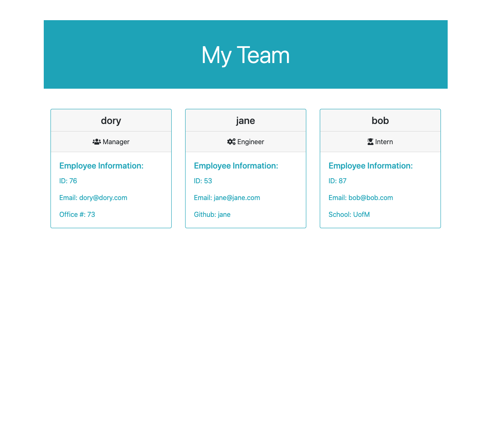

Team Profile Generator
## Table of Contents
  * [Description](#Description)
  * [Application_Screenshot_&_Video](#Application_Screenshot_&_Video)
  * [Application_Install_Instructions](#Application_Install_Instructions)
  * [Questions](#Questions)

## Description
A command-line application that accepts user input
when prompted for information about your team, then generates an html file with employee information.

## Application Screenshot & Video

[Download Command Line Walkthrough Video](assets/profilegeneratormovie.mov)

## Application Install Instructions
1. Clone this github.
2. Add NPM Inquirer to your bash/terminal.

Team Profile Generator GitHub Repo: 
https://github.com/dorykahale/team-profile-generator

  ## Questions
  Contact Information
  Github [dorykahale](https://github.com/dorykahale)
  Email: dorykahale@gmail.com

